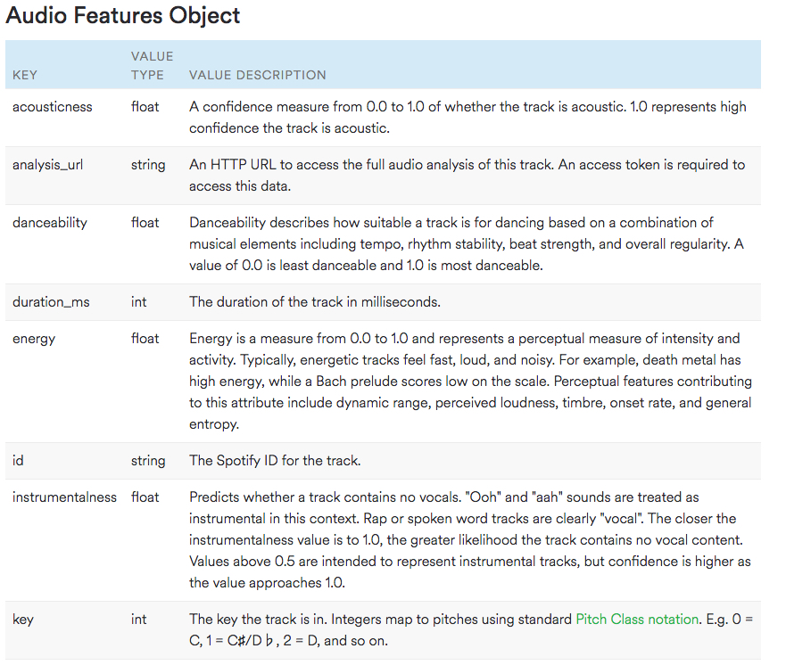
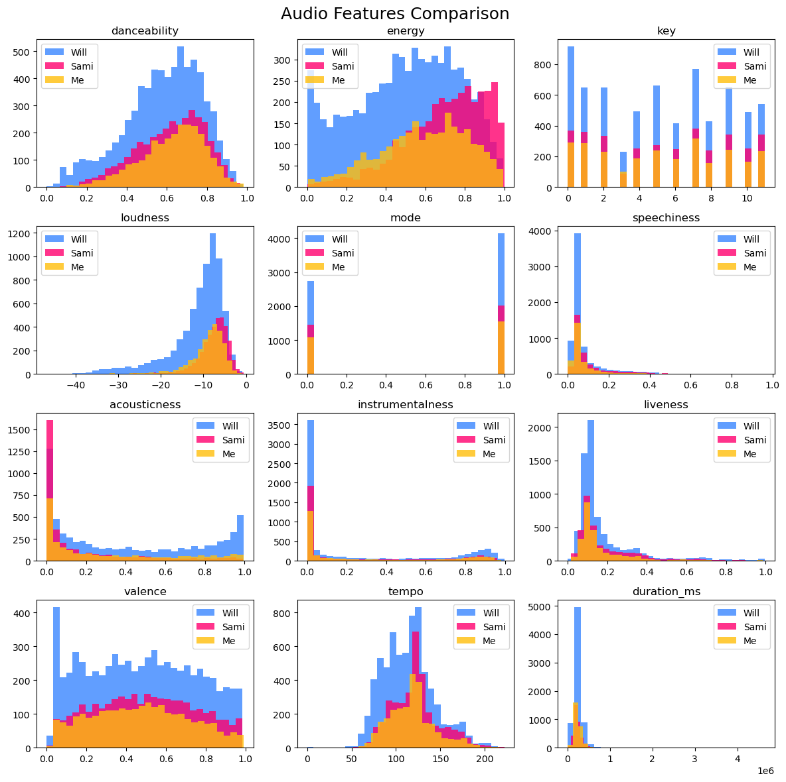
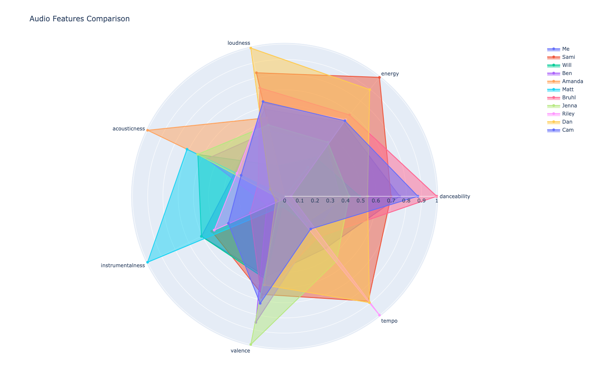
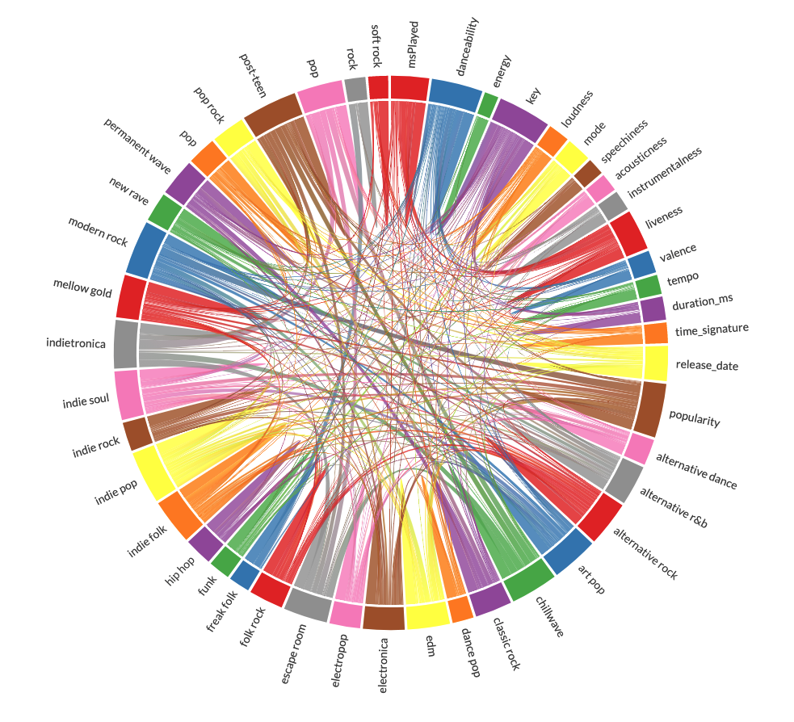
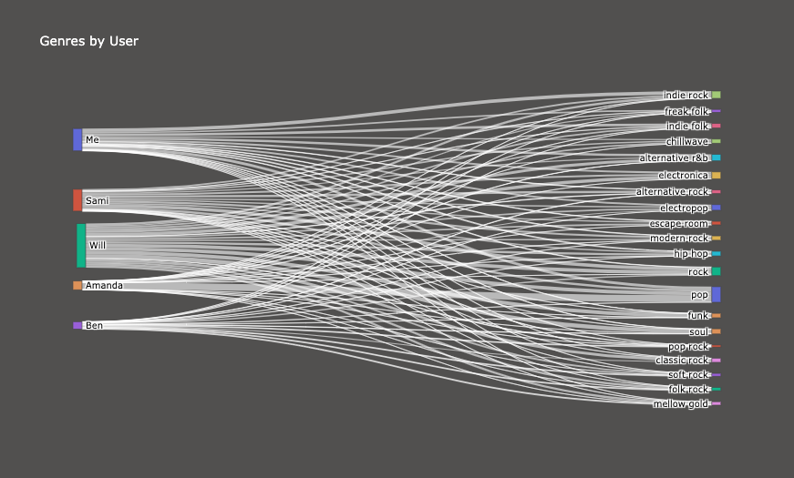

# Capstone Project: Whose Song Is It Anyway?
### By: Sam Lindy (DSIR-Nightingale)

## Problem Statement
Taste in music can feel like a deeply personal and unique quality - almost like having your own audio thumbprint. But how distinctive is it really? If you compared the music you listened to on Spotify in the last year against a group of ten other people, would you still feel that way?  By analyzing the metadata associated with each song we listen to, could a model differentiate your taste in music from everyone elses?
Let’s find out!

## Data Source(s):

2019-20 Spotify streaming history from 11 people including myself. Those files can be found in the user_data folder.

Spotify API for the rest of the track and audio features. [link](https://developer.spotify.com/) 

## Data Dictionary

## Executive Summary

### Data Collection
The Spotify streaming data was provided by myself and ten friends/GA classmates. These can be requested in your Spotify account and take a few days to arrive.

To fill in the data with additional features I ran several queries using the Spotify API.

### Exploratory Data Analysis
First I created a histogram of three different users data to see if how different they looked from one another.

Then I repeated the process looking at all user data using spider plots.

I made two heatmaps that didn't show any strong correlation with the target classes, so I created a chord diagram to explore the correlation between features.

Lastly, I built a sankey diagram to explore users' listening habits by genre.

### Modeling
The following models were used in this analysis to determine the importance of features/coefficients as well as accuracy score:
Logistic Regression
K Nearest Neighbors
Random Forest Classifier
Support Vector Machines 
XGBoost Classifier
KMeans Clustering

There is also a brief analysis of the songs the model identified incorrectly. Further analysis on thie section is needed.

### Conclusions/Next Steps
Random Forest Classifier produced the highest accuracy score. 
Each model beat the baseline score, but never eclipsed a 50% accuracy score.
Additional feature engineering is required, especially looking at recent listening habits as a potential predictor.
Accuracy could improve if tested against a playlist instead of an individual song.
Business Use Case: recommending users with similar taste to create more social engagement.
PCA was attempted on a dataframe that contained all genres and artists but the model wasn't able to converge. 

